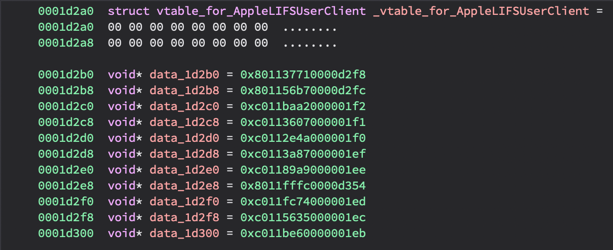
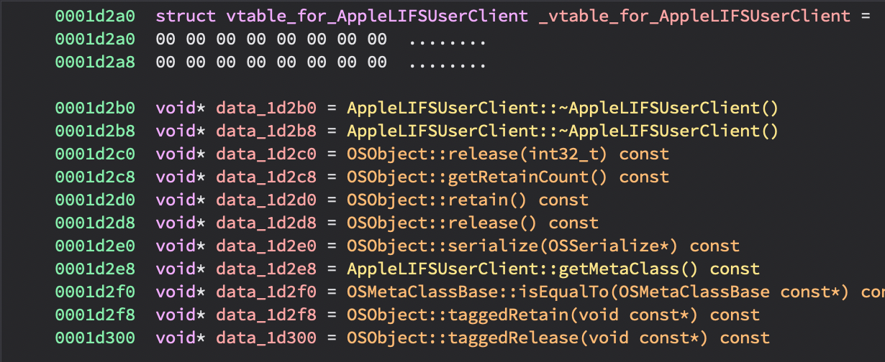

# bn-chained-fixups
This Binary Ninja plugin adds a command to apply the fixup information present in `LC_DYLD_CHAINED_FIXUPS` for M1 Kernel extensions. Information about where fixups were applied is available in the `Log` console. 

As of macOS 12/iOS 15, a new load command (`LC_DYLD_CHAINED_FIXUPS`) is used to store the linker data that dyld uses at process startup. For more information, there's a blog post by Emerge Tools [here](https://www.emergetools.com/blog/posts/iOS15LaunchTime) that explains it at a high level. 

In short, there is a list of start locations of pointer chains for each segment. Each chain entry contains information about whether it needs to be rebased or bound, the information to do so (target or ordinal number), as well as the location of the next entry in the chain. DYLD will traverse each of these chains and apply the necessary fixups. 

# Usage 
To apply fixups for eligible kexts, use the plugin action under `Tools -> Plugins -> Apply LC_DYLD_CHAINED_FIXUPS`.

### Sample Output
```
[*] Fixup header at = 0x20000 
[*] DYLD_CHAINED_STARTS_IN_IMAGE at = 0x20020, with 0x5 segments
[*] Imports table at 0x2006c 
[*] Symbols table at 0x2090c
[*] Chain start at 0x180b4
[*] Rebasing pointer at 0x180b4
[*] Rebasing pointer at 0x180bc
[*] Rebasing pointer at 0x180c8
[*] Rebasing pointer at 0x180d0
[*] Chain start at 0x1c000
[*] Rebasing pointer at 0x1c000
[*] Chain start at 0x1d000
[*] Binding __ZN9IOService20getDeviceMemoryCountEv at 0x1d000
[*] Binding __ZN9IOService24getDeviceMemoryWithIndexEj at 0x1d008

...

[ SNIP ]
```

### Before 


### After


# Programmatic Usage
To call this plugin action from your own plugin or another script, you can use the following snippet:
```python
ctx = plugin.PluginCommandContext(bv)
plugin_list = plugin.PluginCommand.get_valid_list(ctx)
plugin_list['Apply LC_DYLD_CHAINED_FIXUPS'].execute(ctx)
```


